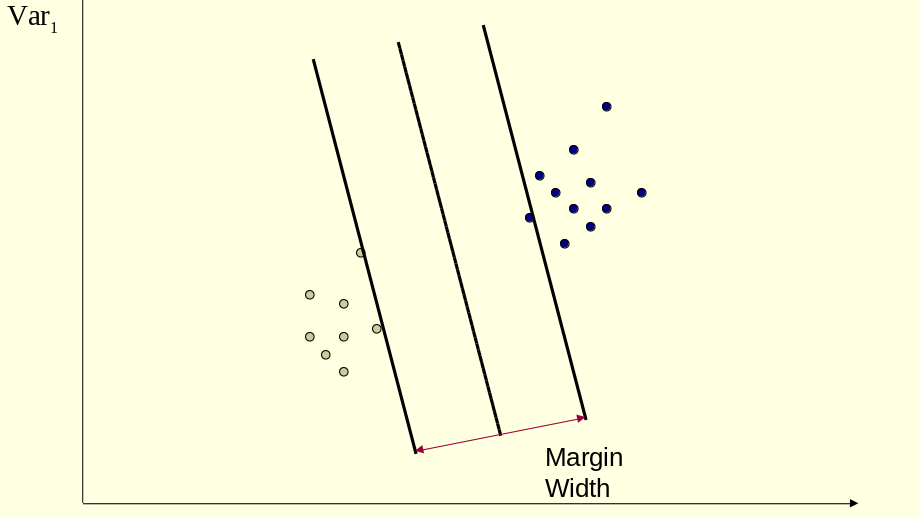
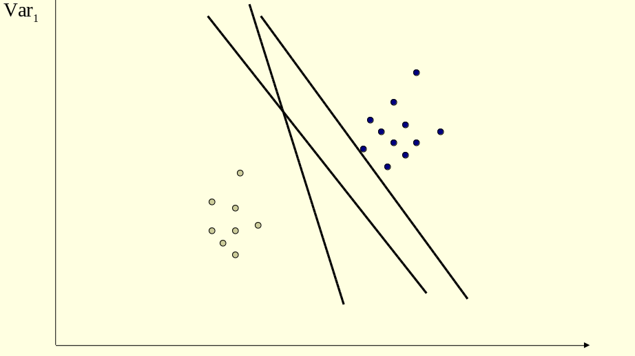
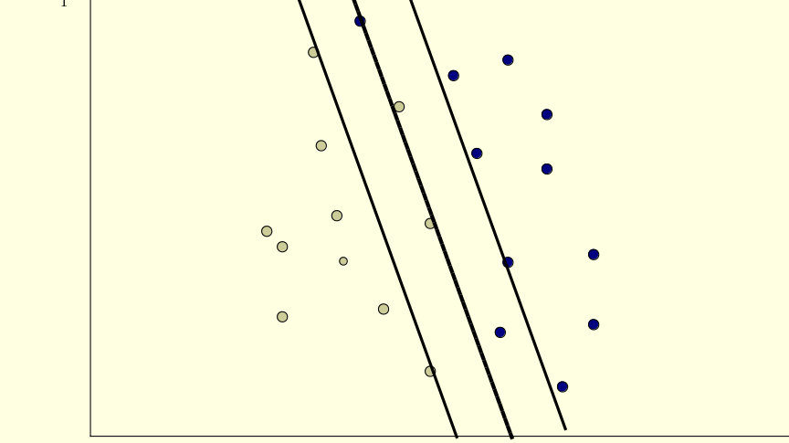
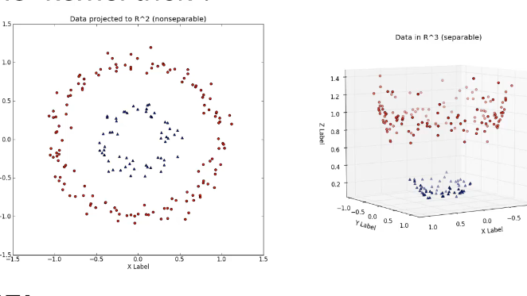

## Support Vector Machine (SVM)
### Contributors: Shakirah Nakalungi, Mark Okello
September 3, 2018

```{r setup, include=T, results='asis'}
knitr::opts_chunk$set(echo = T)
```

### Understanding SVM

SVM is a binary classifier which attempts to find a hyperplane that can separate two class of data points by the largest margin. 
We shall look at margins and  kernel trick which is the **most important** part of SVM that distincts SVM with other classifiers. According to ITSL book they explain SVM as a computer science way of 
doing thing since its the only classifier where you dont use probability.


In summary SVM is a machine learning technique that tries to separate data with a goal to find  the optimal separating hyperplane which maximizes the margin of the training data.

### Maximum Margin Classifier
Maximum Margin Classifier is the simple way to seperate(divide) your data if the training data is "linearly separable". It can not be applied to dataset which is not linearly seperable.




An hyperplane is a generalization of a plane.

1. in one dimension, an hyperplane is a point
2. in two dimensions its a line
3. in three dimensions its a plane
4. in morethan 3 dimensions its hard to visualize it. 

The fact there is a line separating the data points does not mean it is the best one.


so our take home is that an optimal seperating hyperplane got by computing the distance between the hyperplane and the closest data point. Once we have this value, if we double it we get the margin.

### Support Vector Classifier
SVC is an extension to maximum margin classifier which allows some data points to be misclassified as shown below.



### Non Seperable Data

In some cases we are not able to use a soft margin (trying to seperate the data point while allowing failure for some data point to be in the right side but minimize the error on the fails). So in such cases we have to use ***appropriate*** kernel that transforms the input space to a high dimensional feature space where the data points can be seperable.


There are many kernel functions but the common and a must know are:

1. linear: $K(x i , x j ) = x Ti x j$
2. polynomial: $K(x i , x j ) = (γx i T x j + r) d , γ > 0$
3. radial basis function (RBF): $K(x i , x j ) = exp(−γkx i − x j k 2 ), γ > 0$
4. sigmoid: $K(x i , x j ) = tanh(γx i T x j + r)$

---------------

Load the packages to use in the project

```{r echo=T}
library(dplyr)
library(magrittr)
library(flipTime) # To install it first install devtools, library(devtools) to load the it. 
# run install_github("Displayr/flipTime")
```


Loading the data

```{r  echo=T}
phq9_data <- read.csv("data/PHQ_9 FORM.csv")
```

knowning what the data contains
```{r  echo=T}
str(phq9_data)
head(phq9_data, 3)
tail(phq9_data, 3)


```

First lets remove the timestamp from the date in Recieved_At column since the PHQ Administration column doesnot have it.
Removing time zone using grab sub string method, we had no better way of doing it

```{r}
phq9_data$Received_At <- gsub(x=phq9_data$Received_At,pattern=" +00:00",
                              replacement="",fixed=T)
```

lets first convert our two dates columns to Date since they are factors as seen from str() above

```{r}
phq9_data$Received_At <-AsDateTime(phq9_data$Received_At) # using the flipTime package
phq9_data$PHQ_9_Administration <-AsDateTime(phq9_data$PHQ_9_Administration)
```

Since all our time formats are in POSIXct, lets use as.Date trick to get only date for Recieved at and transform PHQ_Administration to Date

```{r}
phq9_data$Received_At <-as.Date(phq9_data$Received_At)
phq9_data$PHQ_9_Administration <-as.Date(phq9_data$PHQ_9_Administration)
```
IF we just tranformed it directly minus transforming date(factor) to POSIXct it would return NA

Getting days between PHQ_Administration and Recieved_at
```{r}
phq9_data$days_in_between <- phq9_data$Received_At- phq9_data$PHQ_9_Administration
head(phq9_data, 3)
```

We nolonger need the Received_At and PHQ_9_Administration columns.

```{r}
phq9_data <- phq9_data[,3:16]
head(phq9_data,3)
```


changing status column as character not factor so that its easy for us to play with it.

```{r}
phq9_data$status <- as.character(phq9_data$status)

```

so since classification takes two factors lets transform status into two levels, 1 - difficuilt(extremely difficult and very difficult), 0 - (somewhat difficult and Not difficult at all)

```{r}
phq9_data$status <- sub("Somewhat Difficult","Not Difficult at All",phq9_data[,13])
phq9_data$status <- sub("Very Difficult","Extremely Difficult",phq9_data[,13])

```

We tried it with a for loop but it took us 7.26 - 8 mins to finish running

we take back the status column to factors
```{r}
phq9_data$status <- as.factor(phq9_data$status)

str(phq9_data$status)
```

------------------------
Ready to start with svm


Many books, tutorials and lectures use the following approach:

1. Transform data to the format of an SVM package
2. Randomly try a few kernels and parameters
3. Test

lets see that!


